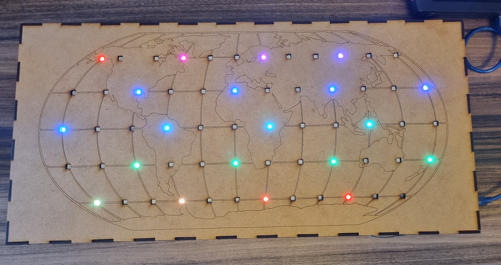
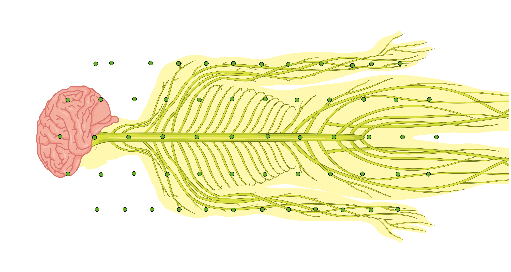

# TG1-Diorama1-Mapa
Diorama Educacional Interativo desenvolvido para a disciplina Projeto de Graduação I da Universidade de Brasília. O Protótipo consiste em um mapa-múndi gravado a laser em uma placa de MDF 3mm integrado a um sistema de fita de LEDs controlado por um Arduino acionado via aplicativo de celular. A partir deste dispositivo, é possível desenvolver diversas práticas pedagógicas relacionando os LEDs endereçáveis com pontos espaciais de interesse.
Foi desenvolvido, como proposta de Diorama Modelo, um mapa-múndi gravado a laser em uma placa de MDF 3mm integrado a um sistema de fita de LEDs, controlado por Arduino e acionado a partir de aplicativo de celular. Este protótipo permite a elaboração de diversas práticas pedagógicas relacionando os LEDs endereçáveis com pontos espaciais de interesse.

O modelo ilustrado pela figura apresenta sessenta LEDs RGB endereçáveis posicionados em coordenadas geográficas estratégicas. A seguir, é possível observar os resultados da implementação do protótipo.

O diorama foi planejado para promover atividades educacionais que explorassem conteúdos importantes de geografia, como a cartografia, os pontos cardeais e a localização espacial por meio de coordenadas. Professor e alunos podem controlar o acionamento dos LEDs por meio de um aplicativo personalizado que se comunica com a solução por meio de comunicação Bluetooth.

Por meio desta interação via \emph{smartphone}, é possível reaproveitar a matriz de LEDs e construir novos mapas para um mesmo diorama. Para tanto, basta imprimir um novo mapa alinhado à matriz citada. Essa funcionalidade está demonstrada nas figuras a seguir:

Conforme ilustrado na figura acima, é possível utilizar a matriz de LEDs para outras aplicações além da geografia, como o estudo da propagação do impulso nervoso. Para cada nova abordagem implementada, também é possível personalizar a aplicação \emph{mobile}.

O último mapa desenvolvido foi para a disciplina de Língua Portuguesa. Aqui, os alunos devem tentar pontuar corretamente a palavra montada. O professor controla o app e mostra a resposta ao final da atividade.

## Materiais Utilizados
* Arduino Uno 
* Placa de MDF 3mm 
* Jumpers 
* FITA DE LED RGB 5050 ENDERECAVEL - WS2812B (5V) - 60 LEDS
* Protoboard 400 pontos
* Módulo Bluetooth HC-05
* Resitor 1k Ohms
* Resitor 2,2k Ohms
* Fio WW 22AWG de cores diversas (Vermelho, branco e preto) - 2 metros
* tubo termorretrátil
* fita isolante

## Código
O Código está disponível na seção de ["Código"](https://github.com/rafaelmdalmoro/TG1-Diorama1-Mapa/tree/main/Codigo) deste repositório.

O código de emergência permite controlar o projeto via cabo, por comunicação Serial com o Arduino.

## Recursos Gráficos
Os materiais para impressão e gravação à laser estão anexados na pasta  ["Recursos"](https://github.com/rafaelmdalmoro/TG1-Diorama1-Mapa/tree/main/Recursos)

## Aplicativo
Você pode baixar o app de controle em  https://gallery.appinventor.mit.edu/?galleryid=d929ec9e-a3fe-40ac-9fc3-0c62eeb87b47

Última atualização - 4 de maio de 2022
